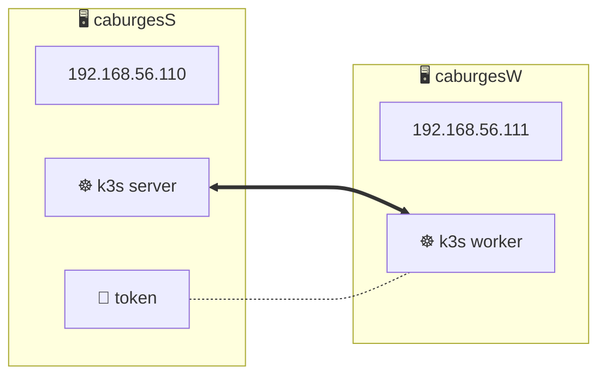
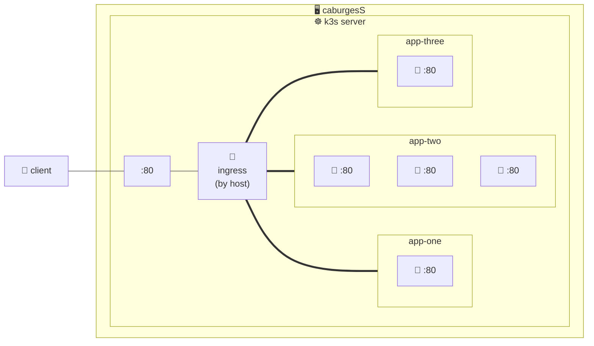
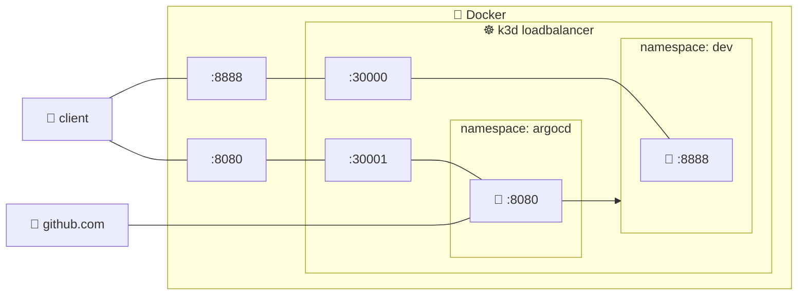
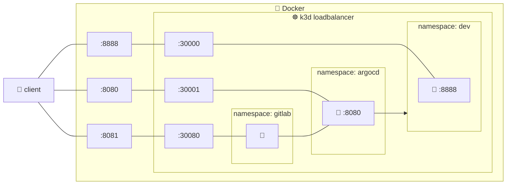

# Inception Of Things

Blablah

# Architecture

## Part 1

```mermaid
flowchart LR
    subgraph server["🖥️ caburgesS"]
        s_ip["192.168.56.110"]
        k3sS["☸️ k3s server"]
        token["📄 token"]
    end
    subgraph worker["🖥️ caburgesW"]
        w_ip["192.168.56.111"]
        k3sW["☸️ k3s worker"]
    end
    k3sS <===> k3sW
    token -.- k3sW
```

## Part 2

```mermaid
flowchart LR
    client["👤 client"]
    subgraph server["🖥️ caburgesS"]
        subgraph k3s["☸️ k3s server"]
            p80[":80"]
            ingress["🔀 
                     ingress
                     (by host)"]
            subgraph app_one["app-one"]
                pod1["🫛 :80"]
            end
            subgraph app_two["app-two"]
                pod2a["🫛 :80"]
                pod2b["🫛 :80"]
                pod2c["🫛 :80"]
            end
            subgraph app_three["app-three"]
                pod3["🫛 :80"]
            end
        end
    end
    p80 --- ingress
    client --- p80
    ingress === app_one
    ingress === app_two
    ingress === app_three
```

## Part 3

```mermaid
flowchart LR
    github["🐙 github.com"]

    client["👤 client"]
    subgraph docker["🐋 Docker"]
        h8080[":8080"]
        h8888[":8888"]
        subgraph k3d["☸️ k3d loadbalancer"]
            lb30001[":30001"]
            lb30000[":30000"]
            subgraph argocd_ns["namespace: argocd"]
                argocd["🐙 :8080"]
            end
            subgraph dev_ns["namespace: dev"]
                app["🫛 :8888"]
            end
        end
    end
    client --- h8080 --- lb30001 --- argocd
    client --- h8888 --- lb30000 ---- app
    github ----- argocd
    argocd --> dev_ns
```

## Bonus

```mermaid
flowchart LR
    client["👤 client"]
    subgraph docker["🐋 Docker"]
        h8080[":8080"]
        h8888[":8888"]
        h8081[":8081"]
        subgraph k3d["☸️ k3d loadbalancer"]
            lb30001[":30001"]
            lb30000[":30000"]
            lb30080[":30080"]
            subgraph argocd_ns["namespace: argocd"]
                argocd["🐙 :8080"]
            end
            subgraph dev_ns["namespace: dev"]
                app["🫛 :8888"]
            end
            subgraph git_ns["namespace: gitlab"]
                gitlab["🐙"]
            end
        end
    end
    client --- h8080 --- lb30001 ---- argocd
    client --- h8888 --- lb30000 ----- app
    client --- h8081 --- lb30080 --- gitlab
    argocd --> dev_ns
    gitlab --- argocd 
```
