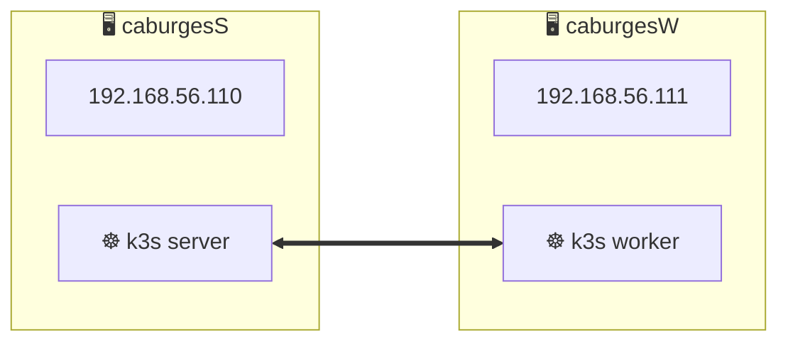
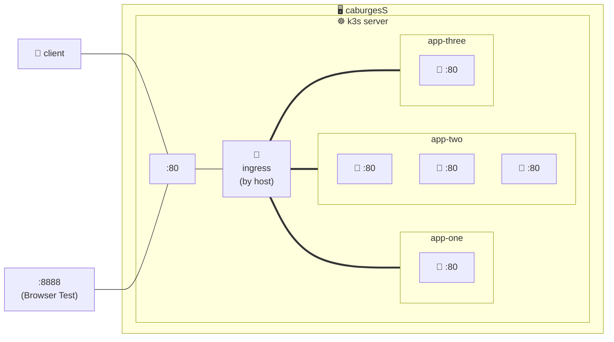
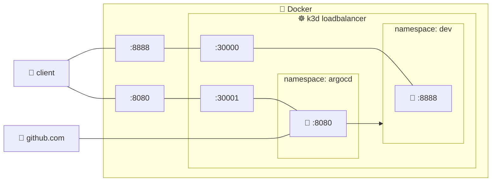
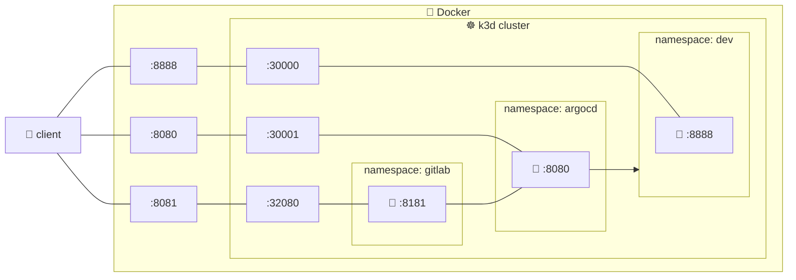

# Inception Of Things

## Usage

g
```bash
$ make
$ make ssh
    $ cd p1
    $ vagrant up
        ...
    $ vagrant destroy
    $ cd ../p2
    $ vagrant up
        ...
    $ vagrant destroy
    $ cd
    $ bash p3/scripts/deploy.sh
        ...
    $ bash bonus/scripts/deploy.sh
    $ cd repo
        ...
$ make fclean
```

- Launch P3: `bash ~/p3/scripts/deploy.sh`
- Launch bonus: `bash ~/bonus/scripts/deploy.sh`
  
# Architecture

## Part 1

### Useful Commands
- Launch the 2 VMs: `vagrant up`
- SSH into the Server machine: `vagrant ssh caburgesS`
- SSH into the Worker machine: `vagrant ssh caburgesSW`
- Detailed info on nodes: `kubectl get nodes -o wide`
- Check network configuration: `ip a`
- Check eth1 interface: `ip a show eth1`

## Part 2

### Useful Commands
- Show details of everything: `kubectl get all`
- Show details of nodes: `kubectl get nodes -o wide`
- Show the Ingress: `kubectl describe ingress`
- Curl with app one as Host: `curl -H "Host: app1.com" 192.168.56.110 | grep 'app-one' `
- Curl with app two as Host: `curl -H "Host: app2.com" 192.168.56.110 | grep 'app-two'`
- Curl with no specified Host: `curl 192.168.56.110 | grep 'app-three'`
- View in browser on host machine: `http://localhost:8888`
- Curl in expozoo machine: `curl app1.com`
- See DNS: `cat /etc/hosts`

## Part 3

### Useful Commands
- Show name spaces: `kubectl get ns`
- Show clusters: `k3d cluster list`
- Show pods in dev namespace: `kubectl get pods -n dev`
- Show pods in argocd namespace: `kubectl get pods -n argocd`
- Curl will app: `curl http://localhost:8888`
- Access argocd web UI: `https://localhost:8080`

## Bonus

### Useful Commands
- `helm status gitlab`
- `helm show values`
- `helm get manifest`
- `helm get values`
- Access argocd web UI: `https://localhost:8080`
- Access gitlab repo: `http://gitlab.localhost:8081`
- View gitlab namespace: `k get all -n gitlab`
  
# Resources
- https://docs.k3s.io/installation/configuration
- https://oneuptime.com/blog/post/2026-02-02-k3s-networking-guide/view
- https://k3d.io/stable/
- https://argo-cd.readthedocs.io/en/stable/
- https://argo-cd.readthedocs.io/en/stable/core_concepts/
- https://argo-cd.readthedocs.io/en/stable/getting_started/
- https://helm.sh/docs/intro/quickstart
- https://docs.gitlab.com/charts/
