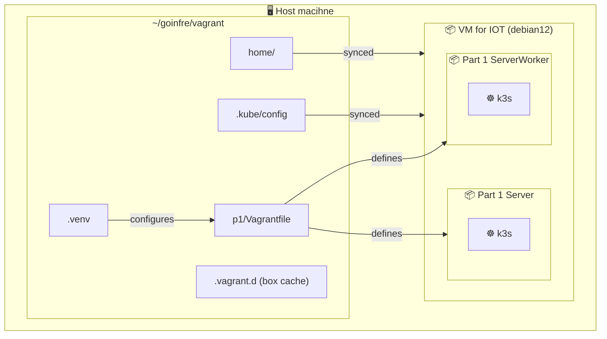

# Inception Of Things

Blablah

# Architecture

```mermaid
flowchart TD
    subgraph Host["🖥️ Host macihne"]
        subgraph goinfre["~/goinfre/vagrant"]
            cache[".vagrant.d (box cache)"]
            home["home/"]
            kubeconfig[".kube/config"]
            part1_vagrantfile["p1/Vagrantfile"]
            env[".venv"]
        end

        subgraph VM["📦 VM for IOT (debian12)"]
            subgraph vm11["📦 Part 1 Server"]
                K3s11["☸️ k3s"]
            end
            subgraph vm12["📦 Part 1 ServerWorker"]
                K3s12["☸️ k3s"]
            end
        end
    end

    home -->|synced| VM
    kubeconfig -->|synced| VM
    part1_vagrantfile -->|defines| vm11
    part1_vagrantfile -->|defines| vm12
    env -->|configures| part1_vagrantfile
```