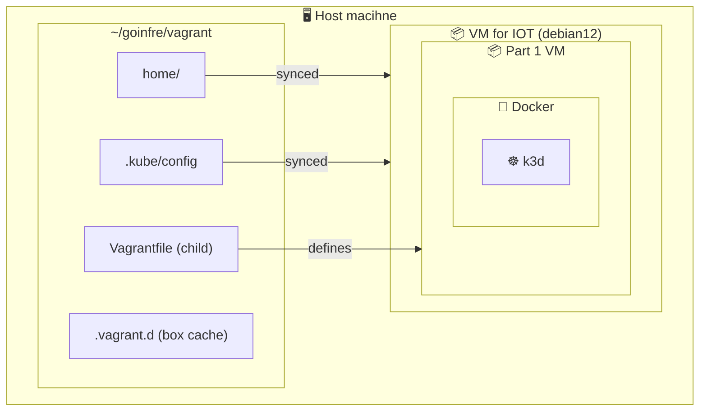

```mermaid
flowchart TD
    subgraph Host["🖥️ Host macihne"]
        subgraph goinfre["~/goinfre/vagrant"]
            cache[".vagrant.d (box cache)"]
            home["home/"]
            kubeconfig[".kube/config"]
            ChildVF["Vagrantfile (child)"]
        end

        subgraph VM["📦 VM for IOT (debian12)"]
            subgraph ChildVM["📦 Part 1 VM"]
                subgraph Docker["🐳 Docker"]
                    K3d["☸️ k3d"]
                end
            end
        end
    end

    home -->|synced| VM
    kubeconfig -->|synced| VM
    ChildVF -->|defines| ChildVM
```